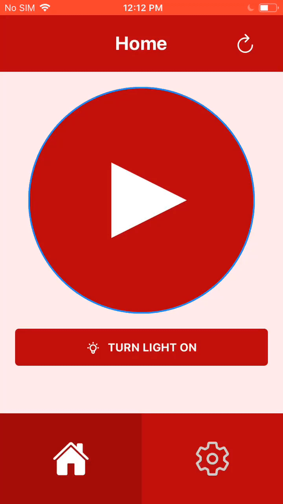

# christmas-v2

My Christmas project update for 2020 (original project is [node-christmas](https://github.com/zane-programs/node-christmas))

## Instructions

1. clone repo and run `npm install --save-dev` to install the required dependencies
2. set config to your liking in `.env` and `server/config.js`
3. run `npm start` (you may need to use `sudo` for elevated permissions)
4. enjoy!

## TODO

1. style application **_[in progress]_**
2. add settings menu **_[in progress]_**
3. (maybe) integrate with Harmony Bridge by using [hue-bridge-emulator](https://github.com/tim-hellhake/hue-bridge-emulator) like last year

## Acknowledgements

This project was bootstrapped with [Create React App](https://github.com/facebook/create-react-app).
